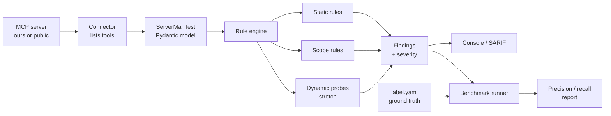

# mcpscan — MCP Security Scanner (GDSC ML-1)

A security scanner for [Model Context Protocol](https://modelcontextprotocol.io) servers, plus
the labeled vulnerable-server corpus that proves whether it actually works.

Existing MCP scanners flag lots of normal tool instructions as attacks (one audit: 27 detections,
only 6 real). Our headline deliverable is not the scanner — it is a **number**: precision and
recall of our scanner against ground truth we built ourselves, with an honest breakdown of every
false positive.

> **Team members:** start with [`TASKS.md`](TASKS.md) to see your role and this week's tasks.
> Every source file begins with a header describing exactly what to build.

## Architecture



Every rule reads the same `ServerManifest` and returns the same `Finding` shape, so rules can be
built in parallel without merge conflicts.

## Repo layout

```
src/mcpscan/
  cli.py            # Typer app: `scan` and `bench`             (Daniel)
  models.py         # Tool, ServerManifest, Finding, Severity    (Rithika)
  connect.py        # stdio/HTTP connect, tools/list -> manifest (Daniel)
  engine.py         # runs every rule over every tool            (Raiyan)
  severity.py       # severity scoring                           (Arnav)
  rules/base.py     # Rule interface                             (Raiyan)
  rules/static/     # imperative, hidden, collision, creds, shadowing (Raiyan)
  rules/scope/      # over_permission + purposes.yaml            (Arnav)
  report/           # console (Rich) + SARIF 2.1.0               (Daniel)
  bench/            # runner, matcher, metrics                   (Arnav)
  dynamic/          # sandboxed probes (stretch)                 (Rithika + pair)
  llm/              # Gemini classifier (stretch)                (Rithika)
corpus/servers/     # deliberately broken MCP servers + label.yaml (Ankitha)
samples/            # raw tools/list JSON from public servers    (Raiyan)
bench/triage.yaml   # human review of real-world findings        (Arnav)
results/            # report.md, results.json, baseline.json     (Arnav)
scripts/            # helper scripts (list_tools.py)             (Daniel)
tests/
```

> Note: benchmark code lives in `src/mcpscan/bench/` (not a top-level `bench/` package) so that
> `pip install` ships the `mcpscan bench` command. `bench/` at the root only holds `triage.yaml`.

## Setup

Requires Python 3.11+, Node.js 18+ (for the MCP Inspector), and Docker Desktop.

```bash
python -m venv .venv
source .venv/bin/activate          # Windows: .venv\Scripts\activate
pip install -e ".[dev]"
pip show mcp                       # version must start with 2
pytest
```

## Usage (target, weeks 4–6)

```bash
mcpscan scan -- python corpus/servers/01_hidden_instructions/server.py
mcpscan scan --url http://localhost:8000/mcp --format sarif --fail-on high
mcpscan scan --file samples/filesystem.tools.json
mcpscan bench corpus/
```

## How we work

- Every change goes through a **pull request** with 1 approval. Nobody pushes to `main`.
- Branch names: `<name>/<short-topic>`, e.g. `ankitha/corpus-03-shadowing`.
- Post a one-line update in #ml-1 midweek.
- Use AI tools freely, but you must be able to explain every line in your PR.
- **SDK v2 only:** `from mcp.server import MCPServer`, `from mcp import Client`. If a tutorial
  says `FastMCP` or `inputSchema`, it is written for v1.

## The one hard rule

Adversarial probes run **only** against servers we wrote. Public servers get static, read-only
analysis — list tools, never call them. Real vulnerabilities found in public servers go to the
maintainer via responsible disclosure first.

## License

MIT — see [LICENSE](LICENSE).
